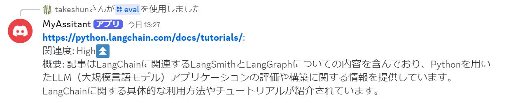

# SmartRSSBot
SmartRSSBotは、Discord上でRSSフィードを定期的に取得し、AIを用いて記事の関連度を評価するボットです。ユーザーは新しい記事の通知を受け取り、AIによるユーザーの趣向との関連度の評価結果を確認することができます。

# Features
- RSSフィードの定期取得：指定したRSSフィードを5分間隔で定期的に取得し、新しい記事があればDiscordチャンネルへ通知します。
- 記事の関連度評価：記事の本文をAIによって解析し、ユーザーの趣向との関連度を評価します。
- 質問応答：記事の本文をAIによって解析し、指定した質問に対する回答を生成します。

AIにはOpenAIのGPT-4oを使用し、記事の取得と関連度評価と質問応答には簡易的なRAG（Retrieval-Augmented Generation）を使用しています。



# Requirements

- Python 3.8
- Discord Bot Token
  - 参考: [Discord.py Botアカウント作成](https://discordpy.readthedocs.io/ja/latest/discord.html)
- OpenAI API Key
    - 参考: [OpenAI API Reference](https://platform.openai.com/docs/api-reference/introduction)

# Installation

1. 依存関係のインストール
```bash
pip install .
```

2. 環境変数の設定
`.env.sample` を参考に、`.env` ファイルを作成し、環境変数を設定してください。
```
# BOT TOKEN
DISCORD_BOT_TOKEN=<Requirementsで用意したDiscord Bot Token>
# API KEY
OPENAI_API_KEY=<Requirementsで用意したOpenAI API Key>
# ID
DISCORD_GUILD_ID=<BOTを作成したギルドID>
DISCORD_CHANNEL_ID=<BOTのメッセージを送信させるチャンネルID>
# FEED
RSS_FEED_URL="<RSSを定期的に受け取りたいRSSフィード>"
DESIRED_ARTICLE_STRING="<どのような記事を受け取りたいか？例: Python、特にLangChain>"
```

3. ボットの起動
```bash
python smartrssbot/bot.py
```

4. ボットのコマンド
- `/rss` : 最新のRSSフィードを取得し、前回のフィードと比較して新しい記事があれば.envで指定したチャンネルへメッセージを送信します。
- `/eval <url>`: 指定したURLの記事の関連度を評価します。
- `/question <url> <question>`: 指定したURLの記事に対して、指定した質問に対する回答を生成します。
